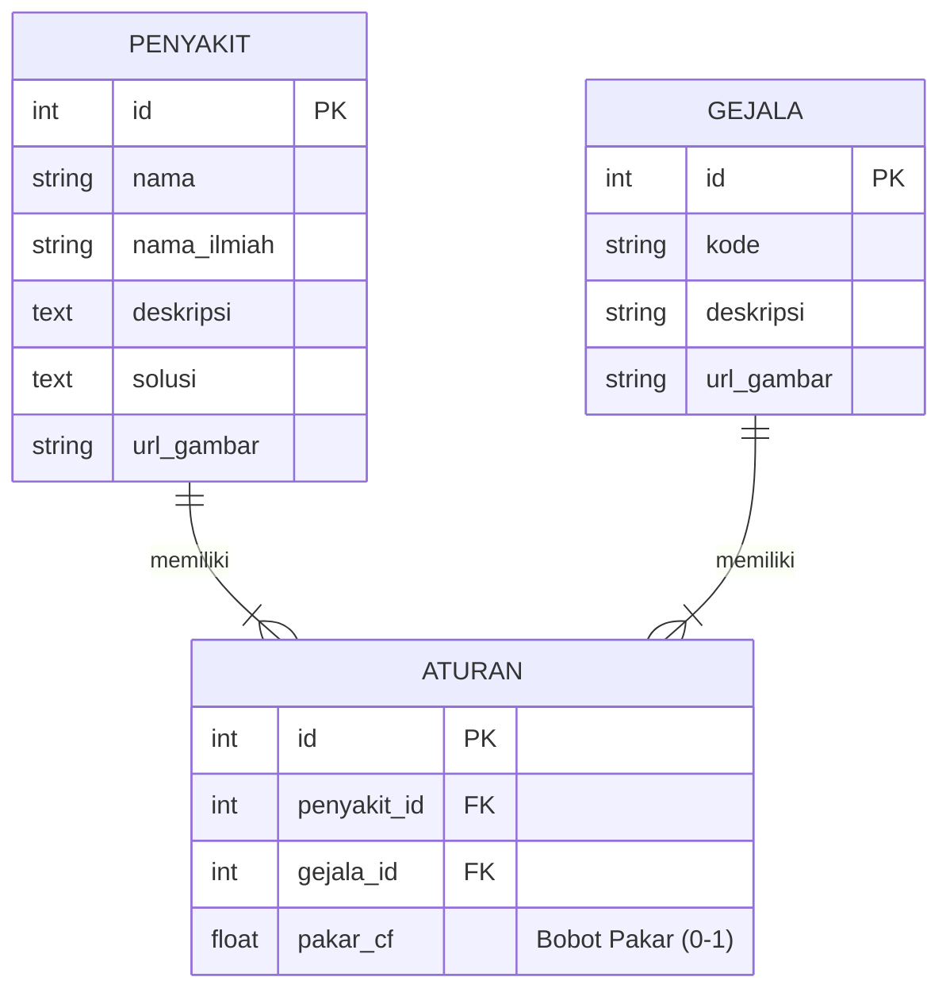

# KangkungKu - Sistem Pakar Diagnosa Penyakit Kangkung

Aplikasi Sistem Pakar untuk mendiagnosa penyakit pada tanaman Kangkung Air menggunakan metode **Certainty Factor (CF)**. Aplikasi ini dibangun dengan **FastAPI** (Python) dan antarmuka web modern menggunakan HTML & Tailwind CSS.

## 1. Diagram Alir Sistem (Flowchart)

Berikut adalah alur proses diagnosa dalam sistem:

```mermaid
flowchart TD
    A([Mulai]) --> B[Pengguna Memilih Gejala yang Diamati]
    B --> C[Pengguna Memasukkan Tingkat Keyakinan (CF User)]
    C --> D{Apakah ada gejala lain?}
    D -- Ya --> B
    D -- Tidak --> E[Sistem Mengambil Data Aturan & Bobot Pakar]
    E --> F[Hitung CF Pakar * CF User]
    F --> G[Hitung CF Kombinasi untuk Setiap Penyakit]
    G --> H[Urutkan Hasil Diagnosa Berdasarkan Nilai CF Tertinggi]
    H --> I[Tampilkan Hasil Diagnosa & Solusi]
    I --> J([Selesai])
```

## 2. Use Case Diagram

Diagram interaksi pengguna dengan sistem:

```mermaid
usecaseDiagram
    actor Pengguna
    package "Sistem Pakar KangkungKu" {
        usecase "Melihat Daftar Gejala" as UC1
        usecase "Melakukan Diagnosa" as UC2
        usecase "Melihat Hasil & Solusi" as UC3
        usecase "Melihat Daftar Penyakit" as UC4
    }
    Pengguna --> UC1
    Pengguna --> UC2
    Pengguna --> UC3
    Pengguna --> UC4
    UC2 ..> UC1 : include
    UC3 ..> UC2 : include
```

## 3. Entity Relationship Diagram (ERD)

Struktur basis data yang digunakan:



## 4. Tabel Data Penyakit

Daftar 15 penyakit yang dapat didiagnosa oleh sistem:

| No | Nama Penyakit | Nama Ilmiah |
|---|---|---|
| 1 | Karat Putih (White Rust) | *Albugo ipomoeae-panduratae* |
| 2 | Bercak Daun Cercospora | *Cercospora ipomoeae* |
| 3 | Virus Mosaik Kangkung | *Water spinach mosaic virus* |
| 4 | Layu Fusarium | *Fusarium oxysporum* |
| 5 | Busuk Akar Pythium | *Pythium spp.* |
| 6 | Busuk Batang Rhizoctonia | *Rhizoctonia solani* |
| 7 | Bercak Daun Alternaria | *Alternaria spp.* |
| 8 | Bercak Daun Bakteri | *Pseudomonas / Xanthomonas* |
| 9 | Embun Tepung (Powdery Mildew) | *Erysiphe spp.* |
| 10 | Embun Bulu (Downy Mildew) | *Peronospora spp.* |
| 11 | Antraknosa | *Colletotrichum spp.* |
| 12 | Serangan Kutu Daun (Aphids) | *Aphidoidea* |
| 13 | Serangan Tungau Laba-laba | *Tetranychidae* |
| 14 | Pengorok Daun (Leaf Miner) | *Liriomyza spp.* |
| 15 | Kekurangan Nitrogen | *Nutrient Deficiency* |

## 5. Tabel Data Gejala

Daftar 25 gejala yang digunakan untuk diagnosa:

| Kode | Deskripsi Gejala |
|---|---|
| G01 | Bercak putih menonjol pada sisi bawah daun |
| G02 | Bercak kuning pada sisi atas daun |
| G03 | Daun melengkung atau terdistorsi |
| G04 | Bercak bulat dengan pusat abu-abu/putih |
| G05 | Bercak dengan tepi coklat tua/merah |
| G06 | Pola mosaik hijau terang/gelap pada daun |
| G07 | Pertumbuhan tanaman kerdil |
| G08 | Daun bagian bawah menguning |
| G09 | Tanaman layu pada siang hari, pulih malam hari |
| G10 | Jaringan pembuluh batang berwarna coklat |
| G11 | Akar berwarna coklat dan lembek |
| G12 | Batang lunak dan gelap di dekat tanah |
| G13 | Lesi cekung kemerahan pada batang |
| G14 | Bercak seperti target dengan cincin konsentris |
| G15 | Bercak basah dikelilingi halo kuning |
| G16 | Serbuk putih pada permukaan daun |
| G17 | Pertumbuhan berbulu halus abu-abu/ungu di bawah daun |
| G18 | Lesi cekung gelap pada batang/daun |
| G19 | Serangga kecil berkumpul di pucuk/bawah daun |
| G20 | Bintik-bintik kuning/putih halus pada daun |
| G21 | Jaring halus pada tanaman |
| G22 | Terowongan putih berkelok-kelok di dalam daun |
| G23 | Daun tua menguning secara menyeluruh |
| G24 | Daun berlubang (shot-holes) |
| G25 | Massa spora merah muda terlihat |

## 6. Tabel Basis Pengetahuan (Rule dan Bobot Pakar)

Berikut adalah daftar lengkap aturan diagnosa beserta nilai Certainty Factor (CF) dari pakar:

| No | Nama Penyakit | Kode Gejala | CF Pakar |
|---|---|---|---|
| 1 | Karat Putih (White Rust) | G01 | 0.9 |
| 2 | Karat Putih (White Rust) | G02 | 0.7 |
| 3 | Karat Putih (White Rust) | G03 | 0.5 |
| 4 | Bercak Daun Cercospora | G04 | 0.8 |
| 5 | Bercak Daun Cercospora | G05 | 0.8 |
| 6 | Bercak Daun Cercospora | G08 | 0.4 |
| 7 | Virus Mosaik Kangkung | G06 | 0.95 |
| 8 | Virus Mosaik Kangkung | G03 | 0.6 |
| 9 | Virus Mosaik Kangkung | G07 | 0.7 |
| 10 | Layu Fusarium | G08 | 0.6 |
| 11 | Layu Fusarium | G09 | 0.9 |
| 12 | Layu Fusarium | G10 | 0.8 |
| 13 | Layu Fusarium | G07 | 0.5 |
| 14 | Busuk Akar Pythium | G11 | 0.9 |
| 15 | Busuk Akar Pythium | G07 | 0.6 |
| 16 | Busuk Akar Pythium | G09 | 0.5 |
| 17 | Busuk Batang Rhizoctonia | G12 | 0.8 |
| 18 | Busuk Batang Rhizoctonia | G13 | 0.9 |
| 19 | Busuk Batang Rhizoctonia | G09 | 0.4 |
| 20 | Bercak Daun Alternaria | G14 | 0.9 |
| 21 | Bercak Daun Alternaria | G08 | 0.5 |
| 22 | Bercak Daun Bakteri | G15 | 0.9 |
| 23 | Bercak Daun Bakteri | G24 | 0.7 |
| 24 | Bercak Daun Bakteri | G08 | 0.4 |
| 25 | Embun Tepung (Powdery Mildew) | G16 | 0.95 |
| 26 | Embun Tepung (Powdery Mildew) | G03 | 0.5 |
| 27 | Embun Bulu (Downy Mildew) | G17 | 0.9 |
| 28 | Embun Bulu (Downy Mildew) | G02 | 0.6 |
| 29 | Embun Bulu (Downy Mildew) | G08 | 0.5 |
| 30 | Antraknosa | G18 | 0.8 |
| 31 | Antraknosa | G25 | 0.7 |
| 32 | Antraknosa | G07 | 0.4 |
| 33 | Serangan Kutu Daun (Aphids) | G19 | 0.9 |
| 34 | Serangan Kutu Daun (Aphids) | G03 | 0.7 |
| 35 | Serangan Kutu Daun (Aphids) | G06 | 0.3 |
| 36 | Serangan Tungau Laba-laba | G20 | 0.9 |
| 37 | Serangan Tungau Laba-laba | G21 | 0.8 |
| 38 | Serangan Tungau Laba-laba | G08 | 0.4 |
| 39 | Pengorok Daun (Leaf Miner) | G22 | 0.95 |
| 40 | Kekurangan Nitrogen | G23 | 0.9 |
| 41 | Kekurangan Nitrogen | G07 | 0.5 |
| 42 | Kekurangan Nitrogen | G08 | 0.8 |

## 7. Tabel Konversi Bobot Pengguna (User)

Pengguna dapat memasukkan tingkat keyakinan terhadap gejala yang dialami menggunakan slider (0.1 - 1.0). Berikut interpretasi nilainya:

| Nilai CF User | Tingkat Keyakinan |
|---|---|
| 0.0 - 0.2 | Tidak Tahu / Sangat Ragu |
| 0.2 - 0.4 | Sedikit Yakin |
| 0.4 - 0.6 | Cukup Yakin |
| 0.6 - 0.8 | Yakin |
| 0.8 - 1.0 | Sangat Yakin |

## 8. Simulasi Perhitungan Certainty Factor Secara Manual

Misalkan pengguna memilih gejala untuk penyakit **Karat Putih** dengan keyakinan tertentu:

1.  **Gejala 1 (G01)**: Bercak putih menonjol
    *   CF Pakar: 0.9
    *   CF User: 0.8 (Sangat Yakin)
    *   **CF(1)** = 0.9 * 0.8 = **0.72**

2.  **Gejala 2 (G02)**: Bercak kuning
    *   CF Pakar: 0.7
    *   CF User: 0.6 (Cukup Yakin)
    *   **CF(2)** = 0.7 * 0.6 = **0.42**

3.  **Perhitungan CF Kombinasi (CF Combine)**:
    Rumus: $CF_{new} = CF_{old} + CF_{current} \times (1 - CF_{old})$

    *   Langkah 1 (Gabungkan CF1 dan CF2):
        $$CF_{old} = CF(1) = 0.72$$
        $$CF_{current} = CF(2) = 0.42$$
        $$CF_{combine} = 0.72 + 0.42 \times (1 - 0.72)$$
        $$CF_{combine} = 0.72 + 0.42 \times 0.28$$
        $$CF_{combine} = 0.72 + 0.1176$$
        $$CF_{combine} = \mathbf{0.8376}$$

    *   **Hasil Akhir**: Tingkat keyakinan sistem untuk penyakit Karat Putih adalah **83.76%**.

## 9. Alur Antarmuka Pengguna (User Interface)

1.  **Halaman Utama (Home)**: Pengenalan sistem dan tombol mulai diagnosa.
2.  **Halaman Diagnosa**:
    *   Daftar gejala ditampilkan dalam bentuk kartu grid.
    *   Pengguna mengklik gejala yang dialami.
    *   Slider muncul untuk mengatur tingkat keyakinan (default 0.8).
    *   Tombol "Dapatkan Hasil" memproses data ke server.
3.  **Halaman Hasil**:
    *   Menampilkan penyakit dengan persentase tertinggi.
    *   Detail penyakit (Deskripsi, Nama Ilmiah, Gambar).
    *   Solusi penanganan yang disarankan.
    *   Tabel rincian perhitungan gejala yang dipilih.

## 10. Pengujian Akurasi Sistem (Validasi Pakar)

Akurasi sistem divalidasi dengan membandingkan hasil diagnosa sistem dengan diagnosa pakar asli terhadap sejumlah kasus uji.

Metode pengujian:
1.  **Confusion Matrix**: Menghitung True Positive, False Positive, True Negative, dan False Negative.
2.  **Tingkat Akurasi**: $\frac{\text{Jumlah Kasus Benar}}{\text{Total Kasus}} \times 100\%$

Sistem ini dirancang untuk memberikan rekomendasi awal. Jika hasil diagnosa memiliki persentase rendah (< 50%), disarankan untuk berkonsultasi langsung dengan ahli pertanian.
