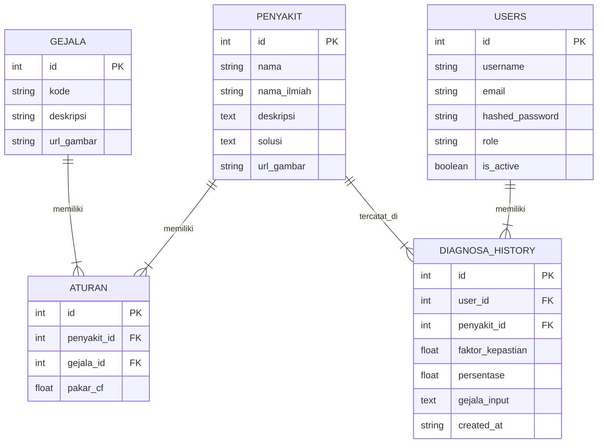
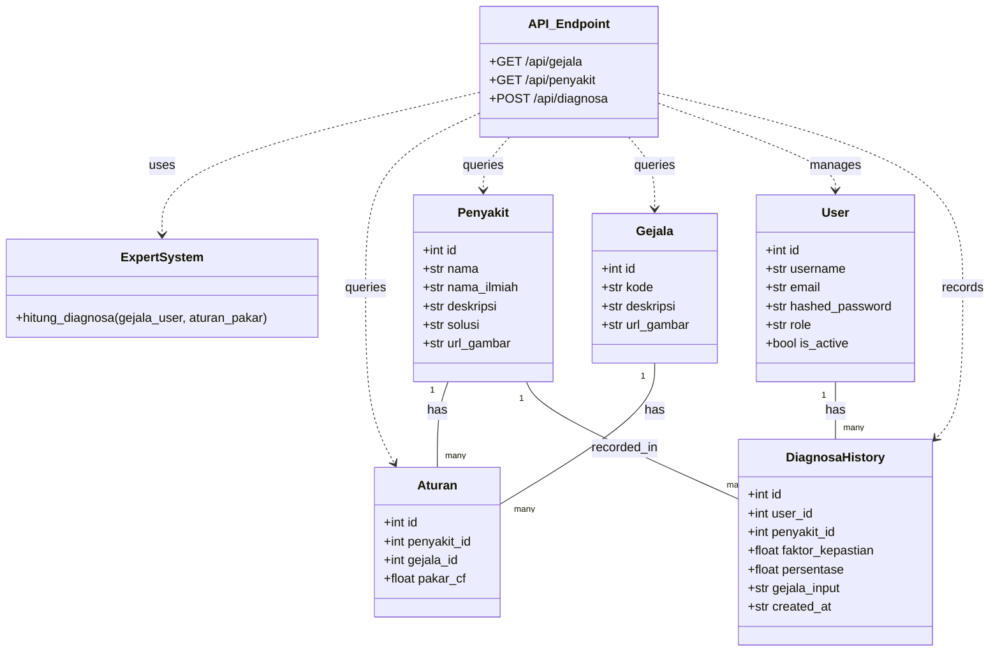
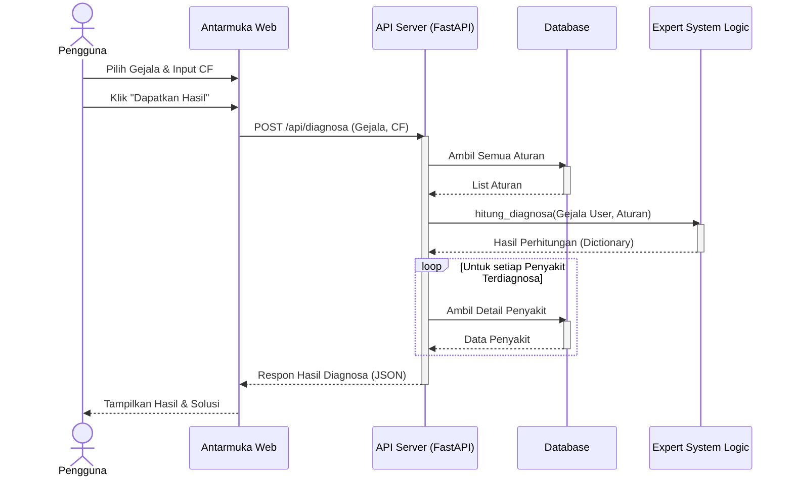

# KangkungKu - Sistem Pakar Diagnosa Penyakit Kangkung

Aplikasi Sistem Pakar untuk mendiagnosa penyakit pada tanaman Kangkung Air menggunakan metode **Certainty Factor (CF)**. Aplikasi ini dibangun dengan **FastAPI** (Python) dan antarmuka web modern menggunakan HTML & Tailwind CSS.

## Instalasi dan Menjalankan Aplikasi

Proyek ini menggunakan `uv` untuk manajemen dependensi dan lingkungan virtual.

### Prasyarat
- Python 3.12 atau lebih baru
- `uv` (diinstal via `pip install uv` atau metode lainnya)

### Langkah-langkah
1.  **Clone repository ini**
2.  **Instal dependensi**
    ```bash
    uv sync
    ```
3.  **Inisialisasi Database**
    Jalankan script seed untuk mengisi database dengan data penyakit, gejala, dan aturan pakar:
    ```bash
    uv run seed.py
    ```
4.  **Jalankan Server**
    ```bash
    uv run uvicorn app.main:app --reload
    ```
    Aplikasi akan berjalan di http://127.0.0.1:8000.

## 1. Diagram Alir Sistem (Flowchart)

Berikut adalah alur proses diagnosa dalam sistem:


```mermaid
flowchart TD
    Start(( )):::startNode --> B(Pengguna Memilih Gejala yang Diamati)
    B --> C(Pengguna Memasukkan Tingkat Keyakinan CF User)
    C --> D{Apakah ada gejala lain?}
    D -- Ya --> B
    D -- Tidak --> E(Sistem Mengambil Data Aturan & Bobot Pakar)
    E --> F(Hitung CF Pakar * CF User)
    F --> G(Hitung CF Kombinasi untuk Setiap Penyakit)
    G --> H(Urutkan Hasil Diagnosa Berdasarkan Nilai CF Tertinggi)
    H --> I(Tampilkan Hasil Diagnosa & Solusi)
    I --> End((( ))):::endNode

    classDef startNode fill:#000,stroke:#000;
    classDef endNode fill:#000,stroke:#000,stroke-width:4px;
```

## 2. Use Case Diagram

Diagram interaksi pengguna dengan sistem:

```mermaid
usecaseDiagram
    actor Pengguna
    package "Sistem Pakar KangkungKu" {
        usecase "Melihat Daftar Gejala" as UC1
        usecase "Melakukan Diagnosa" as UC2
        usecase "Melihat Hasil & Solusi" as UC3
        usecase "Melihat Daftar Penyakit" as UC4
    }
    Pengguna --> UC1
    Pengguna --> UC2
    Pengguna --> UC3
    Pengguna --> UC4
    UC2 ..> UC1 : include
    UC3 ..> UC2 : include
```

## 3. Entity Relationship Diagram (ERD)

Struktur basis data yang digunakan:


```mermaid
erDiagram
    PENYAKIT ||--|{ ATURAN : memiliki
    GEJALA ||--|{ ATURAN : memiliki
    USERS ||--|{ DIAGNOSA_HISTORY : memiliki
    PENYAKIT ||--|{ DIAGNOSA_HISTORY : tercatat_di

    PENYAKIT {
        int id PK
        string nama
        string nama_ilmiah
        text deskripsi
        text solusi
        string url_gambar
    }

    GEJALA {
        int id PK
        string kode
        string deskripsi
        string url_gambar
    }

    ATURAN {
        int id PK
        int penyakit_id FK
        int gejala_id FK
        float pakar_cf
    }

    USERS {
        int id PK
        string username
        string email
        string hashed_password
        string role
        boolean is_active
    }

    DIAGNOSA_HISTORY {
        int id PK
        int user_id FK
        int penyakit_id FK
        float faktor_kepastian
        float persentase
        text gejala_input
        string created_at
    }
```

## 4. Activity Diagram

Diagram aktivitas yang menggambarkan alur kerja sistem untuk Pengguna dan Admin dengan format *swimlane* (Pengguna vs Sistem):

### 4.1. Alur Aktivitas Pengguna (User)

Diagram ini mencakup proses diagnosa, melihat ensiklopedia, dan manajemen akun pengguna.
,

```mermaid
flowchart TD
    subgraph "Pengguna (User)"
        U_Start(( )):::startNode --> U_Landing(Buka Halaman Utama)
        U_Landing --> U_Nav{Pilih Menu}
        
        U_Nav -- "Login" --> U_Login(Input Kredensial)
        U_Nav -- "Register" --> U_Reg(Input Data Akun Baru)
        U_Nav -- "Diagnosa" --> U_Diag(Masuk Halaman Diagnosa)
        U_Nav -- "Ensiklopedia" --> U_Ency(Buka Daftar Penyakit)
        U_Nav -- "Riwayat" --> U_Hist(Lihat Riwayat Saya)
        U_Nav -- "Fitur Lain" --> U_Other(Komunitas / Kalkulator)
        
        U_Diag --> U_Select(Pilih Gejala & Geser Slider CF)
        U_Select --> U_Submit(Klik Dapatkan Hasil)
        
        U_Ency --> U_Detail(Lihat Detail & Solusi)
    end

    subgraph "Sistem (Backend/Database)"
        U_Login --> S_Auth{Validasi Login?}
        S_Auth -- "Sukses" --> U_Landing
        S_Auth -- "Gagal" --> U_Login

        U_Reg --> S_Reg{Validasi Data?}
        S_Reg -- "Sukses" --> U_Login
        S_Reg -- "Gagal" --> U_Reg
        
        U_Diag --> S_GetG(Ambil Daftar Gejala dari DB)
        S_GetG --> U_Diag
        
        U_Submit --> S_Calc(Hitung CF dengan Expert System)
        S_Calc --> S_Save(Simpan Hasil ke History)
        S_Save --> S_Result(Tampilkan Hasil & Persentase)
        
        U_Ency --> S_GetP(Ambil Data Penyakit & Gejala)
        S_GetP --> U_Ency
        
        U_Hist --> S_CheckL{Cek Login?}
        S_CheckL -- "Ya" --> S_GetH(Ambil Data History User)
        S_CheckL -- "Tidak" --> S_Warn(Tampilkan Pesan Login)
        S_GetH --> U_Hist

        U_Other --> S_ShowO(Tampilkan Konten Halaman)
    end

    S_Result --> U_End((( ))):::endNode
    U_Detail --> U_End
    S_Warn --> U_End
    S_ShowO --> U_End

    classDef startNode fill:#000,stroke:#000;
    classDef endNode fill:#000,stroke:#000,stroke-width:4px;
```

### 4.2. Alur Aktivitas Admin

Diagram ini mencakup proses manajemen basis pengetahuan (gejala, penyakit, dan aturan).


```mermaid
flowchart TD
    subgraph "Admin"
        A_Start(( )):::startNode --> A_Login(Login Akun Admin)
        A_Login --> A_Dash(Masuk Dashboard Admin)
        A_Dash --> A_Menu{Pilih Manajemen}
        
        A_Menu -- "Kelola Gejala" --> A_Gejala(Tampilkan List Gejala)
        A_Menu -- "Kelola Penyakit" --> A_Penyakit(Tampilkan List Penyakit)
        A_Menu -- "Statistik" --> A_Stat(Lihat Grafik & Data)
        
        A_Gejala --> A_FormG(Tambah / Edit / Hapus Gejala)
        A_Penyakit --> A_FormP(Tambah / Edit / Hapus Penyakit)
        
        A_FormG --> A_SaveG(Klik Simpan)
        A_FormP --> A_SaveP(Klik Simpan)
    end

    subgraph "Sistem (Admin API)"
        A_Login --> S_AuthA{Validasi Admin?}
        S_AuthA -- "Admin" --> A_Dash
        S_AuthA -- "Bukan Admin" --> A_Login
        
        A_SaveG --> S_UpdateG(Update Database Gejala)
        A_SaveP --> S_UpdateP(Update Database Penyakit)
        
        S_UpdateG --> S_Notif(Tampilkan Notifikasi Berhasil)
        S_UpdateP --> S_Notif
        
        A_Stat --> S_GetS(Hitung Total Data & History)
        S_GetS --> A_Stat
    end

    S_Notif --> A_End((( ))):::endNode
    A_Stat --> A_End

    classDef startNode fill:#000,stroke:#000;
    classDef endNode fill:#000,stroke:#000,stroke-width:4px;
```

## 5. Class Diagram

Struktur kelas dan relasi antar komponen backend:


```mermaid
classDiagram
    class Penyakit {
        +int id
        +str nama
        +str nama_ilmiah
        +str deskripsi
        +str solusi
        +str url_gambar
    }

    class Gejala {
        +int id
        +str kode
        +str deskripsi
        +str url_gambar
    }

    class Aturan {
        +int id
        +int penyakit_id
        +int gejala_id
        +float pakar_cf
    }

    class User {
        +int id
        +str username
        +str email
        +str hashed_password
        +str role
        +bool is_active
    }

    class DiagnosaHistory {
        +int id
        +int user_id
        +int penyakit_id
        +float faktor_kepastian
        +float persentase
        +str gejala_input
        +str created_at
    }

    class ExpertSystem {
        +hitung_diagnosa(gejala_user, aturan_pakar)
    }

    class API_Endpoint {
        +GET /api/gejala
        +GET /api/penyakit
        +POST /api/diagnosa
    }

    Penyakit "1" -- "many" Aturan : has
    Gejala "1" -- "many" Aturan : has
    User "1" -- "many" DiagnosaHistory : has
    Penyakit "1" -- "many" DiagnosaHistory : recorded_in
    API_Endpoint ..> ExpertSystem : uses
    API_Endpoint ..> Aturan : queries
    API_Endpoint ..> Penyakit : queries
    API_Endpoint ..> Gejala : queries
    API_Endpoint ..> User : manages
    API_Endpoint ..> DiagnosaHistory : records
```

## 6. Sequence Diagram

Interaksi antar objek selama proses diagnosa:


```mermaid
sequenceDiagram
    actor User as Pengguna
    participant UI as Antarmuka Web
    participant API as API Server (FastAPI)
    participant DB as Database
    participant ES as Expert System Logic

    User->>UI: Pilih Gejala & Input CF
    User->>UI: Klik "Dapatkan Hasil"
    UI->>API: POST /api/diagnosa (Gejala, CF)
    activate API
    API->>DB: Ambil Semua Aturan
    activate DB
    DB-->>API: List Aturan
    deactivate DB
    API->>ES: hitung_diagnosa(Gejala User, Aturan)
    activate ES
    ES-->>API: Hasil Perhitungan (Dictionary)
    deactivate ES

    loop Untuk setiap Penyakit Terdiagnosa
        API->>DB: Ambil Detail Penyakit
        activate DB
        DB-->>API: Data Penyakit
        deactivate DB
    end

    API-->>UI: Respon Hasil Diagnosa (JSON)
    deactivate API
    UI-->>User: Tampilkan Hasil & Solusi
```

## 7. Tabel Data Penyakit

Daftar 8 penyakit yang dapat didiagnosa oleh sistem:

| No | Kode | Nama Penyakit | Nama Ilmiah |
|---|---|---|---|
| 1 | P01 | Karat Putih (White Rust) | *Albugo ipomoeae-panduratae* |
| 2 | P02 | Bercak Daun Cercospora | *Cercospora ipomoeae* |
| 3 | P03 | Virus Mosaik Kangkung | *Water spinach mosaic virus* |
| 4 | P04 | Layu Fusarium | *Fusarium oxysporum* |
| 5 | P05 | Busuk Akar Pythium | *Pythium spp.* |
| 6 | P06 | Busuk Batang Rhizoctonia | *Rhizoctonia solani* |
| 7 | P07 | Embun Tepung (Powdery Mildew) | *Erysiphe spp.* |
| 8 | P08 | Embun Bulu (Downy Mildew) | *Peronospora spp.* |

## 8. Tabel Data Gejala

Daftar 15 gejala yang digunakan untuk diagnosa:

| No | Kode Gejala | Nama Gejala |
|---|---|---|
| 1 | G001 | Bercak putih menonjol pada sisi bawah daun |
| 2 | G002 | Bercak kuning pada sisi atas daun |
| 3 | G003 | Daun melengkung atau terdistorsi |
| 4 | G004 | Bercak bulat dengan pusat abu-abu/putih |
| 5 | G005 | Bercak dengan tepi coklat tua/merah |
| 6 | G006 | Pola mosaik hijau terang/gelap pada daun |
| 7 | G007 | Pertumbuhan tanaman kerdil |
| 8 | G008 | Daun bagian bawah menguning |
| 9 | G009 | Tanaman layu pada siang hari, pulih malam hari |
| 10 | G010 | Jaringan pembuluh batang berwarna coklat |
| 11 | G011 | Akar berwarna coklat dan lembek |
| 12 | G012 | Batang lunak dan gelap di dekat tanah |
| 13 | G013 | Lesi cekung kemerahan pada batang |
| 14 | G014 | Pertumbuhan berbulu halus abu-abu/ungu di bawah daun |
| 15 | G015 | Serbuk putih pada permukaan daun |

## 8.1. Tabel Hubungan Penyakit dan Gejala

| Penyakit | G001 | G002 | G003 | G004 | G005 | G006 | G007 | G008 | G009 | G010 | G011 | G012 | G013 | G014 | G015 |
|---|:---:|:---:|:---:|:---:|:---:|:---:|:---:|:---:|:---:|:---:|:---:|:---:|:---:|:---:|:---:|
| P01 | √ | √ | √ | | | | | | | | | | | | |
| P02 | | | | √ | √ | | | √ | | | | | | | |
| P03 | | | √ | | | √ | √ | | | | | | | | |
| P04 | | | | | | | √ | √ | √ | √ | | | | | |
| P05 | | | | | | | √ | | √ | | √ | | | | |
| P06 | | | | | | | | | √ | | | √ | √ | | |
| P07 | | | √ | | | | | | | | | | | | √ |
| P08 | | √ | | | | | | √ | | | | | | √ | |

## 9. Tabel Basis Pengetahuan (Rule dan Bobot Pakar)

Berikut adalah daftar lengkap aturan diagnosa beserta nilai Certainty Factor (CF) dari pakar:

| No | Nama Penyakit | Kode Gejala | CF Pakar |
|---|---|---|---|
| 1 | Karat Putih (White Rust) | G01 | 0.9 |
| 2 | Karat Putih (White Rust) | G02 | 0.7 |
| 3 | Karat Putih (White Rust) | G03 | 0.5 |
| 4 | Bercak Daun Cercospora | G04 | 0.8 |
| 5 | Bercak Daun Cercospora | G05 | 0.8 |
| 6 | Bercak Daun Cercospora | G08 | 0.4 |
| 7 | Virus Mosaik Kangkung | G06 | 0.95 |
| 8 | Virus Mosaik Kangkung | G03 | 0.6 |
| 9 | Virus Mosaik Kangkung | G07 | 0.7 |
| 10 | Layu Fusarium | G08 | 0.6 |
| 11 | Layu Fusarium | G09 | 0.9 |
| 12 | Layu Fusarium | G10 | 0.8 |
| 13 | Layu Fusarium | G07 | 0.5 |
| 14 | Busuk Akar Pythium | G11 | 0.9 |
| 15 | Busuk Akar Pythium | G07 | 0.6 |
| 16 | Busuk Akar Pythium | G09 | 0.5 |
| 17 | Busuk Batang Rhizoctonia | G12 | 0.8 |
| 18 | Busuk Batang Rhizoctonia | G13 | 0.9 |
| 19 | Busuk Batang Rhizoctonia | G09 | 0.4 |
| 20 | Bercak Daun Alternaria | G14 | 0.9 |
| 21 | Bercak Daun Alternaria | G08 | 0.5 |
| 22 | Bercak Daun Bakteri | G15 | 0.9 |
| 23 | Bercak Daun Bakteri | G24 | 0.7 |
| 24 | Bercak Daun Bakteri | G08 | 0.4 |
| 25 | Embun Tepung (Powdery Mildew) | G16 | 0.95 |
| 26 | Embun Tepung (Powdery Mildew) | G03 | 0.5 |
| 27 | Embun Bulu (Downy Mildew) | G17 | 0.9 |
| 28 | Embun Bulu (Downy Mildew) | G02 | 0.6 |
| 29 | Embun Bulu (Downy Mildew) | G08 | 0.5 |

## 10. Tabel Konversi Bobot Pengguna (User)

Pengguna dapat memasukkan tingkat keyakinan terhadap gejala yang dialami menggunakan slider (0.1 - 1.0). Berikut interpretasi nilainya:

| Nilai CF User | Tingkat Keyakinan |
|---|---|
| 0.0 - 0.2 | Tidak Tahu / Sangat Ragu |
| 0.2 - 0.4 | Sedikit Yakin |
| 0.4 - 0.6 | Cukup Yakin |
| 0.6 - 0.8 | Yakin |
| 0.8 - 1.0 | Sangat Yakin |

## 11. Simulasi Perhitungan Certainty Factor Secara Manual

Misalkan pengguna memilih gejala untuk penyakit **Karat Putih** dengan keyakinan tertentu:

1.  **Gejala 1 (G01)**: Bercak putih menonjol
    *   CF Pakar: 0.9
    *   CF User: 0.8 (Sangat Yakin)
    *   **CF(1)** = 0.9 * 0.8 = **0.72**

2.  **Gejala 2 (G02)**: Bercak kuning
    *   CF Pakar: 0.7
    *   CF User: 0.6 (Cukup Yakin)
    *   **CF(2)** = 0.7 * 0.6 = **0.42**

3.  **Perhitungan CF Kombinasi (CF Combine)**:
    Rumus: $CF_{new} = CF_{old} + CF_{current} \times (1 - CF_{old})$

    *   Langkah 1 (Gabungkan CF1 dan CF2):
        $$CF_{old} = CF(1) = 0.72$$
        $$CF_{current} = CF(2) = 0.42$$
        $$CF_{combine} = 0.72 + 0.42 \times (1 - 0.72)$$
        $$CF_{combine} = 0.72 + 0.42 \times 0.28$$
        $$CF_{combine} = 0.72 + 0.1176$$
        $$CF_{combine} = \mathbf{0.8376}$$

    *   **Hasil Akhir**: Tingkat keyakinan sistem untuk penyakit Karat Putih adalah **83.76%**.

## 12. Alur Antarmuka Pengguna (User Interface)

1.  **Halaman Utama (Home)**: Pengenalan sistem dan tombol mulai diagnosa.
2.  **Halaman Diagnosa**:
    *   Daftar gejala ditampilkan dalam bentuk kartu grid.
    *   Pengguna mengklik gejala yang dialami.
    *   Slider muncul untuk mengatur tingkat keyakinan (default 0.8).
    *   Tombol "Dapatkan Hasil" memproses data ke server.
3.  **Halaman Hasil**:
    *   Menampilkan penyakit dengan persentase tertinggi.
    *   Detail penyakit (Deskripsi, Nama Ilmiah, Gambar).
    *   Solusi penanganan yang disarankan.
    *   Tabel rincian perhitungan gejala yang dipilih.

## 13. Pengujian Akurasi Sistem (Validasi Pakar)

Akurasi sistem divalidasi dengan membandingkan hasil diagnosa sistem dengan diagnosa pakar asli terhadap sejumlah kasus uji.

Metode pengujian:
1.  **Confusion Matrix**: Menghitung True Positive, False Positive, True Negative, dan False Negative.
2.  **Tingkat Akurasi**: $\frac{\text{Jumlah Kasus Benar}}{\text{Total Kasus}} \times 100\%$

Sistem ini dirancang untuk memberikan rekomendasi awal. Jika hasil diagnosa memiliki persentase rendah (< 50%), disarankan untuk berkonsultasi langsung dengan ahli pertanian.

## 14. Struktur Basis Data

Berikut adalah struktur tabel-tabel yang digunakan dalam basis data sistem pakar KangkungKu:

### 14.1. Tabel: penyakit
| No | Field | Type | Size | Keterangan |
|---|---|---|---|---|
| 1 | id | Int | 11 | Identitas penyakit (Primary Key) |
| 2 | nama | Varchar | 255 | Nama penyakit |
| 3 | nama_ilmiah | Varchar | 255 | Nama ilmiah penyakit |
| 4 | deskripsi | Text | - | Deskripsi lengkap penyakit |
| 5 | solusi | Text | - | Solusi penanganan penyakit |
| 6 | url_gambar | Varchar | 255 | Path atau URL gambar penyakit |

### 14.2. Tabel: gejala
| No | Field | Type | Size | Keterangan |
|---|---|---|---|---|
| 1 | id | Int | 11 | Identitas gejala (Primary Key) |
| 2 | kode | Varchar | 10 | Kode unik gejala |
| 3 | deskripsi | Varchar | 255 | Deskripsi gejala |
| 4 | url_gambar | Varchar | 255 | Path atau URL gambar gejala |

### 14.3. Tabel: aturan
| No | Field | Type | Size | Keterangan |
|---|---|---|---|---|
| 1 | id | Int | 11 | Identitas aturan (Primary Key) |
| 2 | penyakit_id | Int | 11 | ID Penyakit (Foreign Key) |
| 3 | gejala_id | Int | 11 | ID Gejala (Foreign Key) |
| 4 | pakar_cf | Float | - | Nilai Certainty Factor dari pakar |

### 14.4. Tabel: users
| No | Field | Type | Size | Keterangan |
|---|---|---|---|---|
| 1 | id | Int | 11 | Identitas user (Primary Key) |
| 2 | username | Varchar | 50 | Username untuk login |
| 3 | email | Varchar | 100 | Alamat email user |
| 4 | hashed_password | Varchar | 255 | Password yang telah di-hash |
| 5 | role | Varchar | 20 | Role pengguna (admin/user) |
| 6 | is_active | Boolean | - | Status keaktifan akun |
| 7 | alamat | Varchar | 255 | Alamat pengguna |

### 14.5. Tabel: diagnosa_history
| No | Field | Type | Size | Keterangan |
|---|---|---|---|---|
| 1 | id | Int | 11 | Identitas riwayat (Primary Key) |
| 2 | user_id | Int | 11 | ID User (Foreign Key) |
| 3 | penyakit_id | Int | 11 | ID Penyakit (Foreign Key) |
| 4 | faktor_kepastian | Float | - | Nilai faktor kepastian hasil diagnosa |
| 5 | persentase | Float | - | Persentase keyakinan hasil diagnosa |
| 6 | gejala_input | Text | - | Data JSON gejala yang diinputkan |
| 7 | created_at | Varchar | 50 | Waktu dilakukannya diagnosa |
