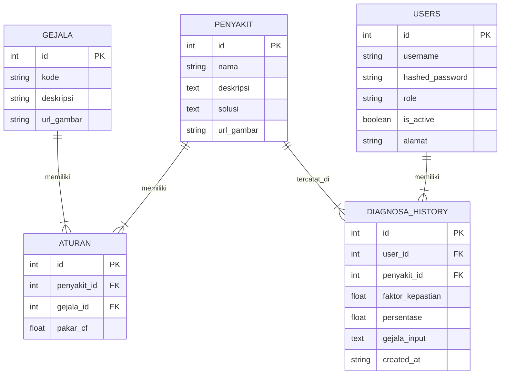
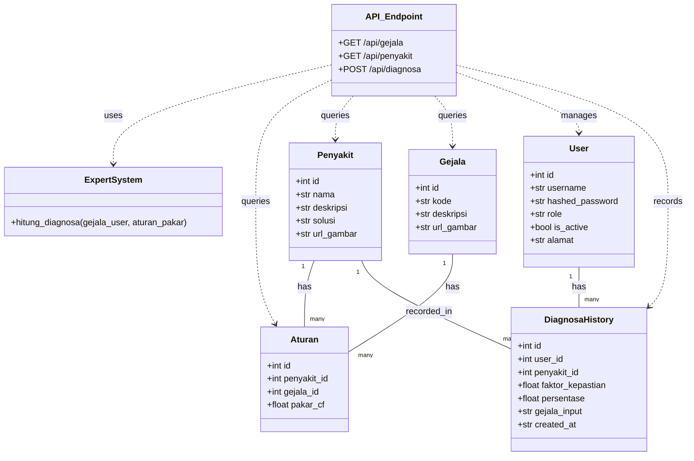
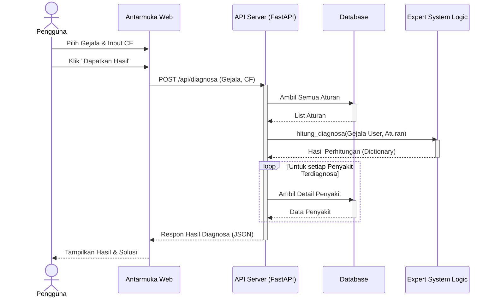

# KangkungKu - Sistem Pakar Diagnosa Penyakit Kangkung

Aplikasi Sistem Pakar untuk mendiagnosa penyakit pada tanaman Kangkung Air menggunakan metode **Certainty Factor (CF)**. Aplikasi ini dibangun dengan **FastAPI** (Python) dan antarmuka web modern menggunakan HTML & Tailwind CSS.

## Instalasi dan Menjalankan Aplikasi

Proyek ini menggunakan `uv` untuk manajemen dependensi dan lingkungan virtual.

### Prasyarat
- Python 3.12 atau lebih baru
- `uv` (diinstal via `pip install uv` atau metode lainnya)

### Langkah-langkah
1.  **Clone repository ini**
2.  **Instal dependensi**
    ```bash
    uv sync
    ```
3.  **Inisialisasi Database**
    Jalankan script seed untuk mengisi database dengan data penyakit, gejala, dan aturan pakar:
    ```bash
    uv run seed.py
    ```
4.  **Jalankan Server**
    ```bash
    uv run uvicorn app.main:app --reload
    ```
    Aplikasi akan berjalan di http://127.0.0.1:8000.

## 1. Diagram Alir Sistem (Flowchart)

Berikut adalah alur proses diagnosa dalam sistem:


```mermaid
flowchart TD
    Start(( )):::startNode --> B(Pengguna Memilih Gejala yang Diamati)
    B --> C(Pengguna Memasukkan Tingkat Keyakinan CF User)
    C --> D{Apakah ada gejala lain?}
    D -- Ya --> B
    D -- Tidak --> E(Sistem Mengambil Data Aturan & Bobot Pakar)
    E --> F(Hitung CF Pakar * CF User)
    F --> G(Hitung CF Kombinasi untuk Setiap Penyakit)
    G --> H(Urutkan Hasil Diagnosa Berdasarkan Nilai CF Tertinggi)
    H --> I(Tampilkan Hasil Diagnosa & Solusi)
    I --> End((( ))):::endNode

    classDef startNode fill:#000,stroke:#000;
    classDef endNode fill:#000,stroke:#000,stroke-width:4px;
```

## 2. Use Case Diagram

Diagram interaksi pengguna dengan sistem:

```mermaid
usecaseDiagram
    actor Pengguna
    package "Sistem Pakar KangkungKu" {
        usecase "Melihat Daftar Gejala" as UC1
        usecase "Melakukan Diagnosa" as UC2
        usecase "Melihat Hasil & Solusi" as UC3
        usecase "Melihat Daftar Penyakit" as UC4
    }
    Pengguna --> UC1
    Pengguna --> UC2
    Pengguna --> UC3
    Pengguna --> UC4
    UC2 ..> UC1 : include
    UC3 ..> UC2 : include
```

## 3. Entity Relationship Diagram (ERD)

Struktur basis data yang digunakan:


```mermaid
erDiagram
    PENYAKIT ||--|{ ATURAN : memiliki
    GEJALA ||--|{ ATURAN : memiliki
    USERS ||--|{ DIAGNOSA_HISTORY : memiliki
    PENYAKIT ||--|{ DIAGNOSA_HISTORY : tercatat_di

    PENYAKIT {
        int id PK
        string nama
        text deskripsi
        text solusi
        string url_gambar
    }

    GEJALA {
        int id PK
        string kode
        string deskripsi
        string url_gambar
    }

    ATURAN {
        int id PK
        int penyakit_id FK
        int gejala_id FK
        float pakar_cf
    }

    USERS {
        int id PK
        string username
        string hashed_password
        string role
        boolean is_active
        string alamat
    }

    DIAGNOSA_HISTORY {
        int id PK
        int user_id FK
        int penyakit_id FK
        float faktor_kepastian
        float persentase
        text gejala_input
        string created_at
    }
```

## 4. Activity Diagram

Diagram aktivitas yang menggambarkan alur kerja sistem untuk Pengguna dan Admin dengan format *swimlane* (Pengguna vs Sistem):

### 4.1. Alur Aktivitas Pengguna (User)

Diagram ini mencakup proses diagnosa, melihat ensiklopedia, dan manajemen akun pengguna.
,

```mermaid
flowchart TD
    subgraph "Pengguna (User)"
        U_Start(( )):::startNode --> U_Landing(Buka Halaman Utama)
        U_Landing --> U_Nav{Pilih Menu}
        
        U_Nav -- "Login" --> U_Login(Input Kredensial)
        U_Nav -- "Register" --> U_Reg(Input Data Akun Baru)
        U_Nav -- "Diagnosa" --> U_Diag(Masuk Halaman Diagnosa)
        U_Nav -- "Ensiklopedia" --> U_Ency(Buka Daftar Penyakit)
        U_Nav -- "Riwayat" --> U_Hist(Lihat Riwayat Saya)
        U_Nav -- "Fitur Lain" --> U_Other(Komunitas / Kalkulator)
        
        U_Diag --> U_Select(Pilih Gejala & Geser Slider CF)
        U_Select --> U_Submit(Klik Dapatkan Hasil)
        
        U_Ency --> U_Detail(Lihat Detail & Solusi)
    end

    subgraph "Sistem (Backend/Database)"
        U_Login --> S_Auth{Validasi Login?}
        S_Auth -- "Sukses" --> U_Landing
        S_Auth -- "Gagal" --> U_Login

        U_Reg --> S_Reg{Validasi Data?}
        S_Reg -- "Sukses" --> U_Login
        S_Reg -- "Gagal" --> U_Reg
        
        U_Diag --> S_GetG(Ambil Daftar Gejala dari DB)
        S_GetG --> U_Diag
        
        U_Submit --> S_Calc(Hitung CF dengan Expert System)
        S_Calc --> S_Save(Simpan Hasil ke History)
        S_Save --> S_Result(Tampilkan Hasil & Persentase)
        
        U_Ency --> S_GetP(Ambil Data Penyakit & Gejala)
        S_GetP --> U_Ency
        
        U_Hist --> S_CheckL{Cek Login?}
        S_CheckL -- "Ya" --> S_GetH(Ambil Data History User)
        S_CheckL -- "Tidak" --> S_Warn(Tampilkan Pesan Login)
        S_GetH --> U_Hist

        U_Other --> S_ShowO(Tampilkan Konten Halaman)
    end

    S_Result --> U_End((( ))):::endNode
    U_Detail --> U_End
    S_Warn --> U_End
    S_ShowO --> U_End

    classDef startNode fill:#000,stroke:#000;
    classDef endNode fill:#000,stroke:#000,stroke-width:4px;
```

### 4.2. Alur Aktivitas Admin

Diagram ini mencakup proses manajemen basis pengetahuan (gejala, penyakit, dan aturan).


```mermaid
flowchart TD
    subgraph "Admin"
        A_Start(( )):::startNode --> A_Login(Login Akun Admin)
        A_Login --> A_Dash(Masuk Dashboard Admin)
        A_Dash --> A_Menu{Pilih Manajemen}
        
        A_Menu -- "Kelola Gejala" --> A_Gejala(Tampilkan List Gejala)
        A_Menu -- "Kelola Penyakit" --> A_Penyakit(Tampilkan List Penyakit)
        A_Menu -- "Statistik" --> A_Stat(Lihat Grafik & Data)
        
        A_Gejala --> A_FormG(Tambah / Edit / Hapus Gejala)
        A_Penyakit --> A_FormP(Tambah / Edit / Hapus Penyakit)
        
        A_FormG --> A_SaveG(Klik Simpan)
        A_FormP --> A_SaveP(Klik Simpan)
    end

    subgraph "Sistem (Admin API)"
        A_Login --> S_AuthA{Validasi Admin?}
        S_AuthA -- "Admin" --> A_Dash
        S_AuthA -- "Bukan Admin" --> A_Login
        
        A_SaveG --> S_UpdateG(Update Database Gejala)
        A_SaveP --> S_UpdateP(Update Database Penyakit)
        
        S_UpdateG --> S_Notif(Tampilkan Notifikasi Berhasil)
        S_UpdateP --> S_Notif
        
        A_Stat --> S_GetS(Hitung Total Data & History)
        S_GetS --> A_Stat
    end

    S_Notif --> A_End((( ))):::endNode
    A_Stat --> A_End

    classDef startNode fill:#000,stroke:#000;
    classDef endNode fill:#000,stroke:#000,stroke-width:4px;
```

## 5. Class Diagram

Struktur kelas dan relasi antar komponen backend:


```mermaid
classDiagram
    class Penyakit {
        +int id
        +str nama
        +str deskripsi
        +str solusi
        +str url_gambar
    }

    class Gejala {
        +int id
        +str kode
        +str deskripsi
        +str url_gambar
    }

    class Aturan {
        +int id
        +int penyakit_id
        +int gejala_id
        +float pakar_cf
    }

    class User {
        +int id
        +str username
        +str hashed_password
        +str role
        +bool is_active
        +str alamat
    }

    class DiagnosaHistory {
        +int id
        +int user_id
        +int penyakit_id
        +float faktor_kepastian
        +float persentase
        +str gejala_input
        +str created_at
    }

    class ExpertSystem {
        +hitung_diagnosa(gejala_user, aturan_pakar)
    }

    class API_Endpoint {
        +GET /api/gejala
        +GET /api/penyakit
        +POST /api/diagnosa
    }

    Penyakit "1" -- "many" Aturan : has
    Gejala "1" -- "many" Aturan : has
    User "1" -- "many" DiagnosaHistory : has
    Penyakit "1" -- "many" DiagnosaHistory : recorded_in
    API_Endpoint ..> ExpertSystem : uses
    API_Endpoint ..> Aturan : queries
    API_Endpoint ..> Penyakit : queries
    API_Endpoint ..> Gejala : queries
    API_Endpoint ..> User : manages
    API_Endpoint ..> DiagnosaHistory : records
```

## 6. Sequence Diagram

Interaksi antar objek selama proses diagnosa:


```mermaid
sequenceDiagram
    actor User as Pengguna
    participant UI as Antarmuka Web
    participant API as API Server (FastAPI)
    participant DB as Database
    participant ES as Expert System Logic

    User->>UI: Pilih Gejala & Input CF
    User->>UI: Klik "Dapatkan Hasil"
    UI->>API: POST /api/diagnosa (Gejala, CF)
    activate API
    API->>DB: Ambil Semua Aturan
    activate DB
    DB-->>API: List Aturan
    deactivate DB
    API->>ES: hitung_diagnosa(Gejala User, Aturan)
    activate ES
    ES-->>API: Hasil Perhitungan (Dictionary)
    deactivate ES

    loop Untuk setiap Penyakit Terdiagnosa
        API->>DB: Ambil Detail Penyakit
        activate DB
        DB-->>API: Data Penyakit
        deactivate DB
    end

    API-->>UI: Respon Hasil Diagnosa (JSON)
    deactivate API
    UI-->>User: Tampilkan Hasil & Solusi
```

## 7. Tabel Data Penyakit

Daftar 9 penyakit/hama yang dapat didiagnosa oleh sistem:

| No | Kode | Nama | Kategori |
|---|---|---|---|---|
| 1 | P01 | Bekicot | Hama |
| 2 | P02 | Ulat Grayak | Hama |
| 3 | P03 | Kutu Daun | Hama |
| 4 | P04 | Ulat Keket | Hama |
| 5 | P05 | Karat Putih | Penyakit |
| 6 | P06 | Bercak Daun | Penyakit |
| 7 | P07 | Bakteri | Penyakit |
| 8 | P08 | Virus | Penyakit |
| 9 | P09 | Alga | Penyakit |

## 8. Tabel Data Gejala

Daftar 24 gejala yang digunakan untuk diagnosa:

| No | Kode | Nama Gejala |
|---|---|---|
| 1 | G001 | Batang dan daun rusak |
| 2 | G002 | Batang dan daun layu |
| 3 | G003 | Batang dan daun busuk |
| 4 | G004 | Daun berlubang |
| 5 | G005 | Pinggir daun bergerigi |
| 6 | G006 | Tanaman kerdil |
| 7 | G007 | Daun melengkung |
| 8 | G008 | Warna daun hijau muda dengan garis menyilang kuning |
| 9 | G009 | Muncul bercak putih pada permukaan daun |
| 10 | G010 | Muncul bercak kecokelatan hingga kehitaman pada permukaan daun |
| 11 | G011 | Mengeluarkan lendir keruh |
| 12 | G012 | Berbau busuk |
| 13 | G013 | Keluar air pada batang |
| 14 | G014 | Lengket jika disentuh |
| 15 | G015 | Daun berwarna kuning pekat |
| 16 | G016 | Batang mengalami bercak-bercak |
| 17 | G017 | Daun menjadi seperti terbakar |
| 18 | G018 | Bentuk daun menjadi tidak sempurna |
| 19 | G019 | Daun layu |
| 20 | G020 | Bercak berwarna kelabu kehijauan pada daun |
| 21 | G021 | Pada permukaan tumbuh rambut berwarna cokelat kemerahan |
| 22 | G022 | Daun dihinggapi lalat |
| 23 | G023 | Batang dan daun kering |
| 24 | G024 | Bercak karat merah pada daun |

## 8.1. Tabel Hubungan Penyakit dan Gejala

| Gejala | P01 | P02 | P03 | P04 | P05 | P06 | P07 | P08 | P09 |
|---|---|---|---|---|---|---|---|---|---|---|
| G001 | √ | √ | | √ | √ | √ | | | |
| G002 | √ | | | | | | | | |
| G003 | √ | | | | | | | | |
| G004 | | √ | | √ | | | | | |
| G005 | | √ | | | | | | | |
| G006 | | | √ | | | | | | |
| G007 | | | √ | | | | | | |
| G008 | | | | √ | | | | | |
| G009 | | | | | √ | | | | |
| G010 | | | | | | √ | | | |
| G011 | | | | | | | √ | | |
| G012 | | | | | | | √ | | |
| G013 | | | | | | | | | |
| G014 | | | | | | | √ | | |
| G015 | | | | | | | | | |
| G016 | | | | | | | | √ | |
| G017 | | | | | | | | √ | |
| G018 | | | | | | | | √ | |
| G019 | | | | | | | | | |
| G020 | | | | | | | | | √ |
| G021 | | | | | | | | | √ |
| G022 | | | | | | | | | |
| G023 | | | | | | | | | |
| G024 | | | | | | | | | √ |

## 9. Tabel Basis Pengetahuan (Rule dan Bobot Pakar)

Berikut adalah daftar lengkap aturan diagnosa beserta nilai Certainty Factor (CF) dari pakar:

| No | Nama Penyakit | Kode Gejala | CF Pakar |
|---|---|---|---|
| 1 | Bekicot | G001 | 1.0 |
| 2 | Bekicot | G002 | 1.0 |
| 3 | Bekicot | G003 | 1.0 |
| 4 | Ulat Grayak | G001 | 1.0 |
| 5 | Ulat Grayak | G004 | 1.0 |
| 6 | Ulat Grayak | G005 | 1.0 |
| 7 | Kutu Daun | G006 | 1.0 |
| 8 | Kutu Daun | G007 | 1.0 |
| 9 | Ulat Keket | G001 | 1.0 |
| 10 | Ulat Keket | G004 | 1.0 |
| 11 | Ulat Keket | G008 | 1.0 |
| 12 | Karat Putih | G001 | 1.0 |
| 13 | Karat Putih | G009 | 1.0 |
| 14 | Bercak Daun | G001 | 1.0 |
| 15 | Bercak Daun | G010 | 1.0 |
| 16 | Bakteri | G011 | 1.0 |
| 17 | Bakteri | G012 | 1.0 |
| 18 | Bakteri | G014 | 1.0 |
| 19 | Virus | G016 | 1.0 |
| 20 | Virus | G017 | 1.0 |
| 21 | Virus | G018 | 1.0 |
| 22 | Alga | G020 | 1.0 |
| 23 | Alga | G021 | 1.0 |
| 24 | Alga | G024 | 1.0 |

## 10. Tabel Konversi Bobot Pengguna (User)

Pengguna dapat memasukkan tingkat keyakinan terhadap gejala yang dialami menggunakan slider (0.1 - 1.0). Berikut interpretasi nilainya:

| Nilai CF User | Tingkat Keyakinan |
|---|---|
| 0.0 - 0.2 | Tidak Tahu / Sangat Ragu |
| 0.2 - 0.4 | Sedikit Yakin |
| 0.4 - 0.6 | Cukup Yakin |
| 0.6 - 0.8 | Yakin |
| 0.8 - 1.0 | Sangat Yakin |

## 11. Perhitungan Certainty Factor (Simulasi)

Metode Certainty Factor (CF) digunakan untuk menggambarkan tingkat keyakinan pakar terhadap suatu gejala yang mengindikasikan penyakit tertentu. Dalam sistem ini, seluruh bobot pakar bernilai **1.0** yang berarti setiap gejala yang terdaftar untuk suatu penyakit merupakan indikator yang sangat kuat.

Rumus dasar perhitungan:

**CF(H,E) = CF(pakar) × CF(user)**

Kemudian untuk kombinasi lebih dari satu gejala digunakan rumus:

**CF_combine(CF_old, CF_new) = CF_old + CF_new × (1 - CF_old)**

Setelah kombinasi seluruh gejala, hasil akhir dikalikan dengan rasio gejala yang cocok terhadap total gejala penyakit:

**CF_akhir = CF_gabungan × (gejala_tercocok / total_gejala)**

---

### 11.1. Kasus Diagnosa: Bekicot (P01)

Seorang petani mengamati tanamannya dan memilih gejala berikut:

**Tabel Gejala dan Nilai Bobot Pakar P01**

| Gejala | Nilai Bobot Pakar |
|---|---|
| (G001) Batang dan daun rusak | 1.0 |
| (G002) Batang dan daun layu | 1.0 |
| (G003) Batang dan daun busuk | 1.0 |

**Tabel Nilai Bobot User P01**

| Gejala | Jawaban User | Bobot (CF User) |
|---|---|---|
| (G001) Batang dan daun rusak | Yakin | 0.8 |
| (G002) Batang dan daun layu | Cukup Yakin | 0.6 |
| (G003) Batang dan daun busuk | Sedikit Yakin | 0.4 |

Selanjutnya, bobot nilai yang dimasukkan pengguna akan dikalikan dengan bobot nilai dari pakar:

*   **Gejala 1** = CF(user) × CF(pakar) = 0.8 × 1.0 = **0.8**
*   **Gejala 2** = CF(user) × CF(pakar) = 0.6 × 1.0 = **0.6**
*   **Gejala 3** = CF(user) × CF(pakar) = 0.4 × 1.0 = **0.4**

Karena terdapat lebih dari satu gejala, maka dilakukan kombinasi CF berurutan:

1.  **CF_combine1(Gejala 1, Gejala 2)**
    *   = CF_gejala1 + CF_gejala2 × (1 - CF_gejala1)
    *   = 0.8 + 0.6 × (1 - 0.8)
    *   = 0.8 + 0.6 × 0.2
    *   **CF_old1 = 0.92**

2.  **CF_combine2(CF_old1, Gejala 3)**
    *   = CF_old1 + CF_gejala3 × (1 - CF_old1)
    *   = 0.92 + 0.4 × (1 - 0.92)
    *   = 0.92 + 0.4 × 0.08
    *   **CF_gabungan = 0.952**

Kemudian hitung rasio kecocokan gejala:
*   **Rasio** = gejala_tercocok / total_gejala = 3 / 3 = **1.0**

Hitung CF akhir:
*   **CF_akhir** = CF_gabungan × Rasio = 0.952 × 1.0 = **0.952**

Selanjutnya hitung persentase keyakinan terhadap penyakit:
*   **Persentase** = CF_akhir × 100
*   = 0.952 × 100
*   = **95.2%**

---

### 11.2. Perbandingan Hasil Kombinasi

Dengan input gejala yang sama (G001, G002, G003), mari bandingkan hasil untuk penyakit lain yang juga memiliki beberapa gejala yang sama:

**Perbandingan Hasil Kombinasi**

| Kode Penyakit | Nama Penyakit | Gejala Cocok | CF Gabungan | Rasio | Hasil Akhir |
|---|---|---|---|---|---|
| P01 | Bekicot | G001, G002, G003 (3/3) | 0.952 | 1.0 | **95.2%** |
| P02 | Ulat Grayak | G001 (1/3) | 0.8 | 0.333 | **26.7%** |
| P05 | Karat Putih | G001 (1/2) | 0.8 | 0.5 | **40.0%** |
| P06 | Bercak Daun | G001 (1/2) | 0.8 | 0.5 | **40.0%** |

**Kesimpulan:**
Dari tabel di atas, sistem akan membandingkan hasil penggabungan nilai CF dan mengambil keputusan berdasarkan nilai penggabungan yang tertinggi setelah dikalikan rasio kecocokan. Maka dapat diketahui bahwa tanaman kangkung terserang hama **Bekicot** dengan nilai kepastian sebesar **95.2%**.

## 12. Alur Antarmuka Pengguna (User Interface)

1.  **Halaman Utama (Home)**: Pengenalan sistem dan tombol mulai diagnosa.
2.  **Halaman Diagnosa**:
    *   Daftar gejala ditampilkan dalam bentuk kartu grid.
    *   Pengguna mengklik gejala yang dialami.
    *   Slider muncul untuk mengatur tingkat keyakinan (default 0.8).
    *   Tombol "Dapatkan Hasil" memproses data ke server.
3.  **Halaman Hasil**:
    *   Menampilkan penyakit dengan persentase tertinggi.
    *   Detail penyakit (Deskripsi, Gambar).
    *   Solusi penanganan yang disarankan.
    *   Tabel rincian perhitungan gejala yang dipilih.

## 13. Pengujian Akurasi Sistem (Validasi Pakar)

Akurasi sistem divalidasi dengan membandingkan hasil diagnosa sistem dengan diagnosa pakar asli terhadap sejumlah kasus uji.

Metode pengujian:
1.  **Confusion Matrix**: Menghitung True Positive, False Positive, True Negative, dan False Negative.
2.  **Tingkat Akurasi**: $\frac{\text{Jumlah Kasus Benar}}{\text{Total Kasus}} \times 100\%$

Sistem ini dirancang untuk memberikan rekomendasi awal. Jika hasil diagnosa memiliki persentase rendah (< 50%), disarankan untuk berkonsultasi langsung dengan ahli pertanian.

## 14. Struktur Basis Data

Berikut adalah struktur tabel-tabel yang digunakan dalam basis data sistem pakar KangkungKu:

### 14.1. Tabel: penyakit
| No | Field | Type | Size | Keterangan |
|---|---|---|---|---|
| 1 | id | Int | 11 | Identitas penyakit (Primary Key) |
| 2 | nama | Varchar | 35 | Nama penyakit |
| 3 | deskripsi | Text | - | Deskripsi lengkap penyakit |
| 4 | solusi | Text | - | Solusi penanganan penyakit |
| 5 | url_gambar | Varchar | 255 | Path atau URL gambar penyakit |

### 14.2. Tabel: gejala
| No | Field | Type | Size | Keterangan |
|---|---|---|---|---|
| 1 | id | Int | 11 | Identitas gejala (Primary Key) |
| 2 | kode | Varchar | 35 | Kode unik gejala |
| 3 | deskripsi | Varchar | 35 | Deskripsi gejala |
| 4 | url_gambar | Varchar | 255 | Path atau URL gambar gejala |

### 14.3. Tabel: aturan
| No | Field | Type | Size | Keterangan |
|---|---|---|---|---|
| 1 | id | Int | 11 | Identitas aturan (Primary Key) |
| 2 | penyakit_id | Int | 11 | ID Penyakit (Foreign Key) |
| 3 | gejala_id | Int | 11 | ID Gejala (Foreign Key) |
| 4 | pakar_cf | Float | - | Nilai Certainty Factor dari pakar |

### 14.4. Tabel: users
| No | Field | Type | Size | Keterangan |
|---|---|---|---|---|
| 1 | id | Int | 11 | Identitas user (Primary Key) |
| 2 | username | Varchar | 35 | Username untuk login |
| 3 | hashed_password | Varchar | 64 | Password yang telah di-hash |
| 4 | role | Varchar | 20 | Role pengguna (admin/user) |
| 5 | is_active | Boolean | - | Status keaktifan akun |
| 6 | alamat | Text | - | Alamat pengguna |

### 14.5. Tabel: diagnosa_history
| No | Field | Type | Size | Keterangan |
|---|---|---|---|---|
| 1 | id | Int | 11 | Identitas riwayat (Primary Key) |
| 2 | user_id | Int | 11 | ID User (Foreign Key) |
| 3 | penyakit_id | Int | 11 | ID Penyakit (Foreign Key) |
| 4 | faktor_kepastian | Float | - | Nilai faktor kepastian hasil diagnosa |
| 5 | persentase | Float | - | Persentase keyakinan hasil diagnosa |
| 6 | gejala_input | Text | - | Data JSON gejala yang diinputkan |
| 7 | created_at | Varchar | 50 | Waktu dilakukannya diagnosa |
