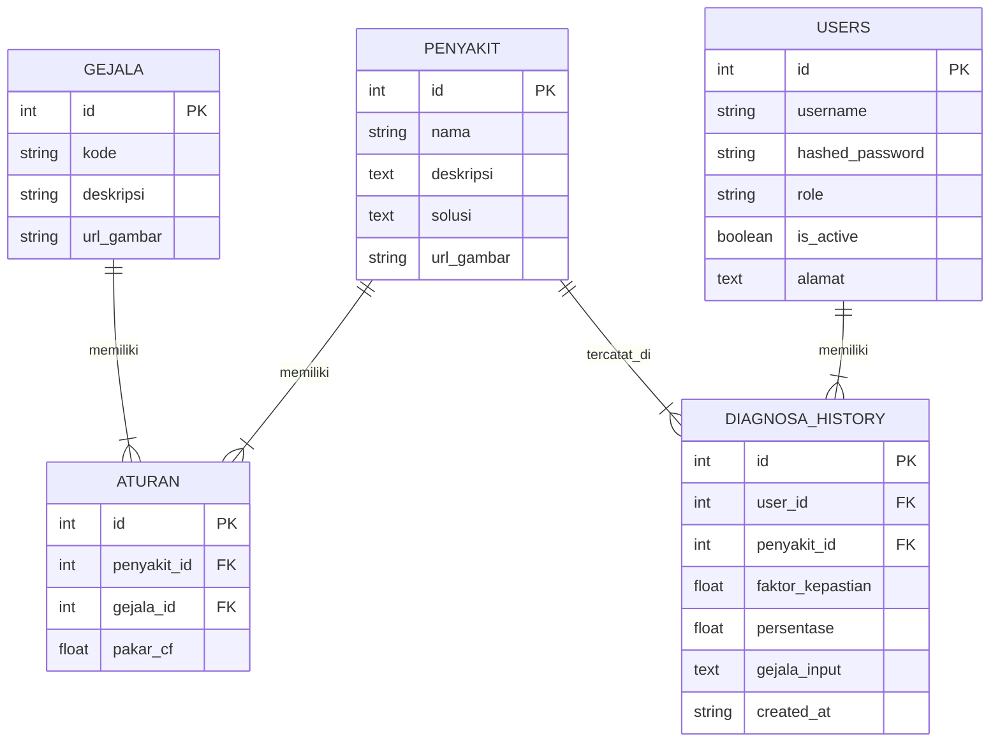

# Entity Relationship Diagram (ERD) - KangkungKu

Berikut adalah struktur basis data aplikasi **KangkungKu** (Sistem Pakar Diagnosa Penyakit Kangkung Air) setelah penghapusan kolom `email` pada tabel `users`.

## 1. Diagram ERD (Mermaid)

## 2. Deskripsi Hubungan Antar Tabel
1. **PENYAKIT ke ATURAN (1 to Many)**: Satu penyakit dapat memiliki banyak gejala/aturan yang mengikatnya.
2. **GEJALA ke ATURAN (1 to Many)**: Satu gejala dapat dikaitkan dengan banyak penyakit dalam basis aturan.
3. **USERS ke DIAGNOSA_HISTORY (1 to Many)**: Satu pengguna dapat melakukan dan menyimpan banyak riwayat diagnosa.
4. **PENYAKIT ke DIAGNOSA_HISTORY (1 to Many)**: Satu diagnosa history akan menunjuk pada satu penyakit hasil diagnosa.
